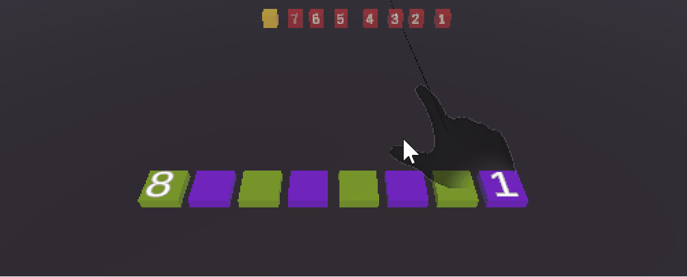

# HRI_AR_Trust_Teamwork

Unity research project for investigating human-robot collaboration and trust in augmented reality.

## Requirements

This project was built using Unity version 2022.3.54f1.

This project requires the Microsoft Mixed Reality Toolkit 3; instructions for installation into your project can be found [here]([https://github.com/labstreaminglayer/App-LabRecorder](https://learn.microsoft.com/en-us/windows/mixed-reality/mrtk-unity/mrtk3-overview/getting-started/setting-up/setup-new-project).

## Task

The project showcases a task intended to be solved by a human wearing a Microsoft HoloLens along with a Robotic/AI companion. The task is to sort blocks into spaces, with the robot handling the odd numbers and the human handling the even numbers. The robot will attempt to help the human if they spend more than 30 seconds moving one of their blocks into place or they place a block in the incorrect place.
